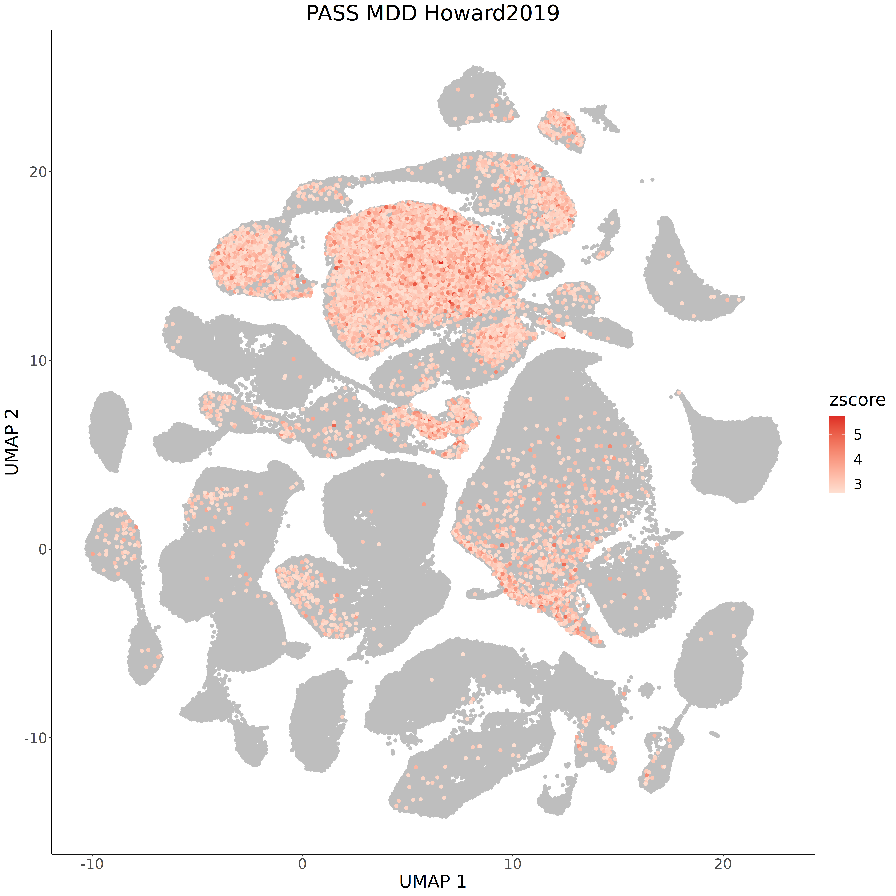
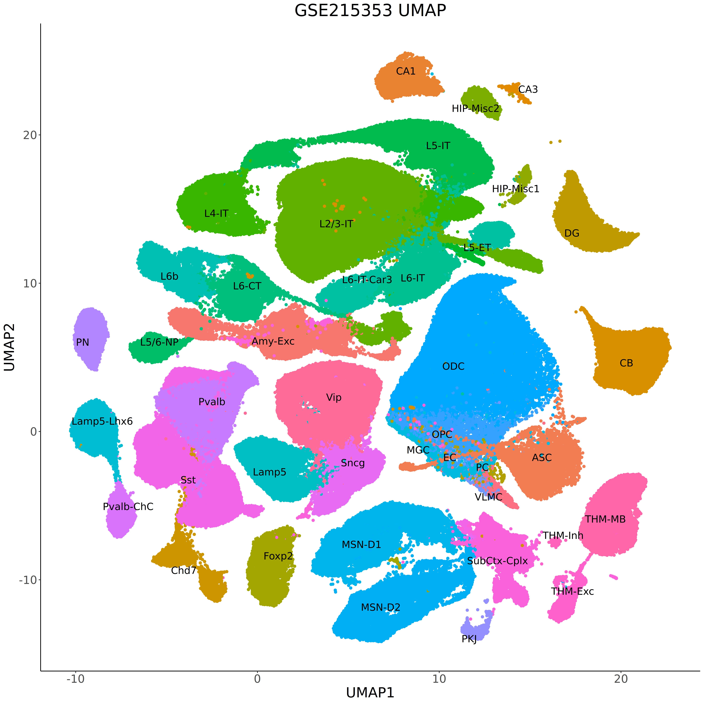

# met-scDRS tutorial

met-scDRS is a statistical tool for finding disease associated cells and genes in single cell methylome data.
This tutorial will illustrate how we used met-scDRS to find:

- Major depression disorder (MDD) associated cells in GSE215353 methylome atlas
- prioritized gene set compared to GWAS MAGMA genes
- brain regions disease association heterogeneity

## Finding MDD associated cells in GSE215353 methylome atlas
### data download:
- [Single-Cell DNA Methylation and 3D Genome Human Brain Atlas](https://cellxgene.cziscience.com/collections/fdebfda9-bb9a-4b4b-97e5-651097ea07b0)

- [DNA methylation atlas of the mouse brain at single-cell resolution](https://www.ncbi.nlm.nih.gov/geo/query/acc.cgi?acc=GSE132489)

### DATA EXTRACTION:
if data follows Allcools format similar to mouse data, you can extract the fraction with the following helper script:
```bash
python data-extraction.py --input_dir <hdf5_dir> --output_dir <output_dir>
```

if data is a simple csv where columns are genes, and rows are cells, you can convert it into a h5ad file with the following helper script:
```bash
Rscript csv-h5ad-conversion.R --data_matrix <fraction_csv> --output_file <output_h5ad_distination>
```

### Installation of met-scDRS
```bash
# Clone the repo
git clone git@github.com:bogdanlab/met-scDRS.git
cd met-scDRS/met-scDRS-method/src

# (Optional) Create a new environment
conda create -n metscdrs-env python=3.10 -y
conda activate metscdrs-env

# Install in editable mode
pip install -e .
```

### USAGE
```bash
# Compute met-scdrs:
met-scdrs compute_score \
    --h5ad_file <h5ad_file> \
    --preprocess True \
    --preprocess_method inverse \
    --variance_clip 5 \
    --h5ad_species human \
    --gs_file <gs_file> \
    --gs_species human \
    --out_folder <out_folder> \
    --cov_file <cov_file> \
    --ctrl_match_opt mean_var \
    --weight_opt inv_std \
    --n_ctrl 1000 \
    --flag_return_ctrl_raw_score False \
    --flag_return_ctrl_norm_score True \
    --verbose True

# for clarity, if no covariates for regression:
met-scdrs compute_score \
    --h5ad_file <h5ad_file> \
    --preprocess True \
    --preprocess_method inverse \
    --variance_clip 5 \
    --h5ad_species human \
    --gs_file <gs_file> \
    --gs_species human \
    --out_folder <out_folder> \
    --ctrl_match_opt mean_var \
    --weight_opt inv_std \
    --n_ctrl 1000 \
    --flag_return_ctrl_raw_score False \
    --flag_return_ctrl_norm_score True \
    --verbose True

```

### DIAGNOSTIC AND VERBOSE
met-scDRS supports --verbose for RAM memory tracking and return to CLI 
also support --diagnostic and --diagnostic_dir flag to visualize control gene set distribution

```bash
met-scdrs compute_score \
    --h5ad_file <h5ad_file> \
    --preprocess True \
    --preprocess_method inverse \
    --variance_clip 5 \
    --h5ad_species human \
    --gs_file <gs_file> \
    --gs_species human \
    --out_folder <out_folder> \
    --ctrl_match_opt mean_var \
    --weight_opt inv_std \
    --n_ctrl 1000 \
    --flag_return_ctrl_raw_score False \
    --flag_return_ctrl_norm_score True \
    --diagnostic True \
    --diagnostic_dir <diagnostic_dir> \
    --verbose True

```

### Visualization in UMAP:

```sh
Rscript GSE215353/met-scDRS-v2.0-run/visualization/significant-cell-visualization-umap.R \
    --dir <out_folder> \
    --meta_data <pmeta_data_csv_file> \
    --xaxis "UMAP_1" \
    --yaxis "UMAP_2" \
    --cutoff 0.1 \
    --out <plotting_directory>
# script assumes UMAP1 and UMAP2 are colnames in the meta_data table, cutoff is the FDR cutoff to consider as significance
```
<p align="center">
  <table>
    <tr>
      <td align="center">
        <br/>
        <sub>Human brain atlas umap for MDD met-scDRS</sub>
      </td>
      <td align="center">
        <br/>
        <sub>Human brain atlas umap colored by cell types</sub>
      </td>
    </tr>
  </table>
</p>

## License

This project is licensed under the MIT License. See below for details.

### met-scDRS License (MIT)

Copyright (c) 2025 Xinzhe Li

Permission is hereby granted, free of charge, to any person obtaining a copy
of this software and associated documentation files (the “Software”), to deal
in the Software without restriction, including without limitation the rights
to use, copy, modify, merge, publish, distribute, sublicense, and/or sell
copies of the Software, and to permit persons to whom the Software is
furnished to do so, subject to the following conditions:

The above copyright notice and this permission notice shall be included in all
copies or substantial portions of the Software.

THE SOFTWARE IS PROVIDED “AS IS”, WITHOUT WARRANTY OF ANY KIND, EXPRESS OR
IMPLIED, INCLUDING BUT NOT LIMITED TO THE WARRANTIES OF MERCHANTABILITY,
FITNESS FOR A PARTICULAR PURPOSE AND NONINFRINGEMENT. IN NO EVENT SHALL THE
AUTHORS OR COPYRIGHT HOLDERS BE LIABLE FOR ANY CLAIM, DAMAGES OR OTHER
LIABILITY, WHETHER IN AN ACTION OF CONTRACT, TORT OR OTHERWISE, ARISING FROM,
OUT OF OR IN CONNECTION WITH THE SOFTWARE OR THE USE OR OTHER DEALINGS IN THE
SOFTWARE.

---

### Includes code from scDRS (MIT License)

Large portions of this software are derived from the scDRS project:
(https://github.com/martinjzhang/scDRS)

Original license:

Copyright (c) 2021 Martin Jinye Zhang and Kangcheng Hou

Permission is hereby granted, free of charge, to any person obtaining a copy
of this software and associated documentation files (the “Software”), to deal
in the Software without restriction, including without limitation the rights
to use, copy, modify, merge, publish, distribute, sublicense, and/or sell
copies of the Software, and to permit persons to whom the Software is
furnished to do so, subject to the following conditions:

The above copyright notice and this permission notice shall be included in all
copies or substantial portions of the Software.

THE SOFTWARE IS PROVIDED “AS IS”, WITHOUT WARRANTY OF ANY KIND, EXPRESS OR
IMPLIED, INCLUDING BUT NOT LIMITED TO THE WARRANTIES OF MERCHANTABILITY,
FITNESS FOR A PARTICULAR PURPOSE AND NONINFRINGEMENT. IN NO EVENT SHALL THE
AUTHORS OR COPYRIGHT HOLDERS BE LIABLE FOR ANY CLAIM, DAMAGES OR OTHER
LIABILITY, WHETHER IN AN ACTION OF CONTRACT, TORT OR OTHERWISE, ARISING FROM,
OUT OF OR IN CONNECTION WITH THE SOFTWARE OR THE USE OR OTHER DEALINGS IN THE
SOFTWARE.
